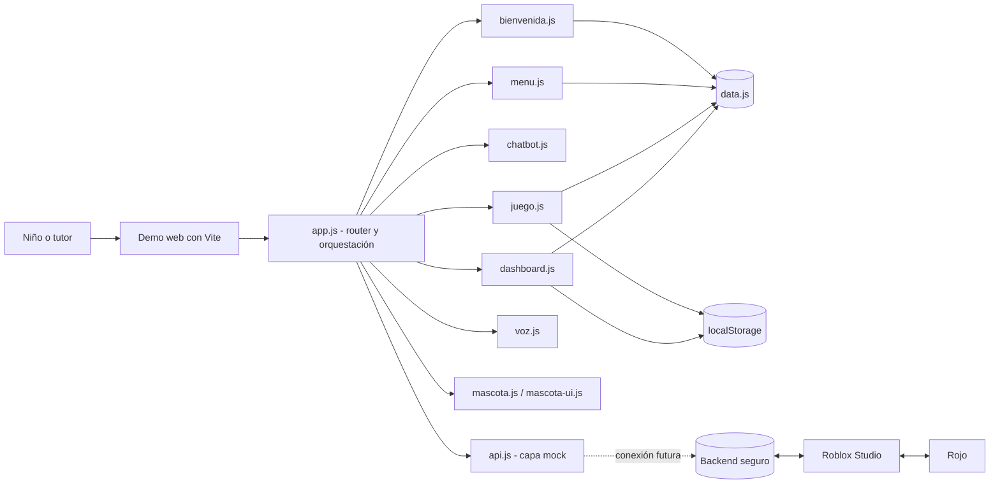
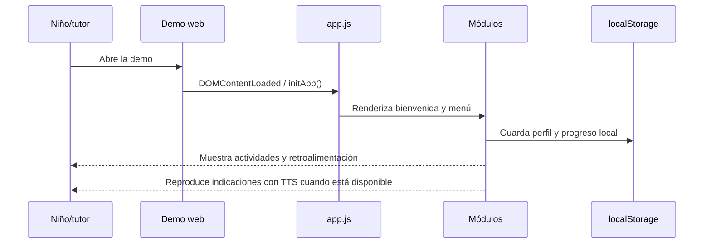
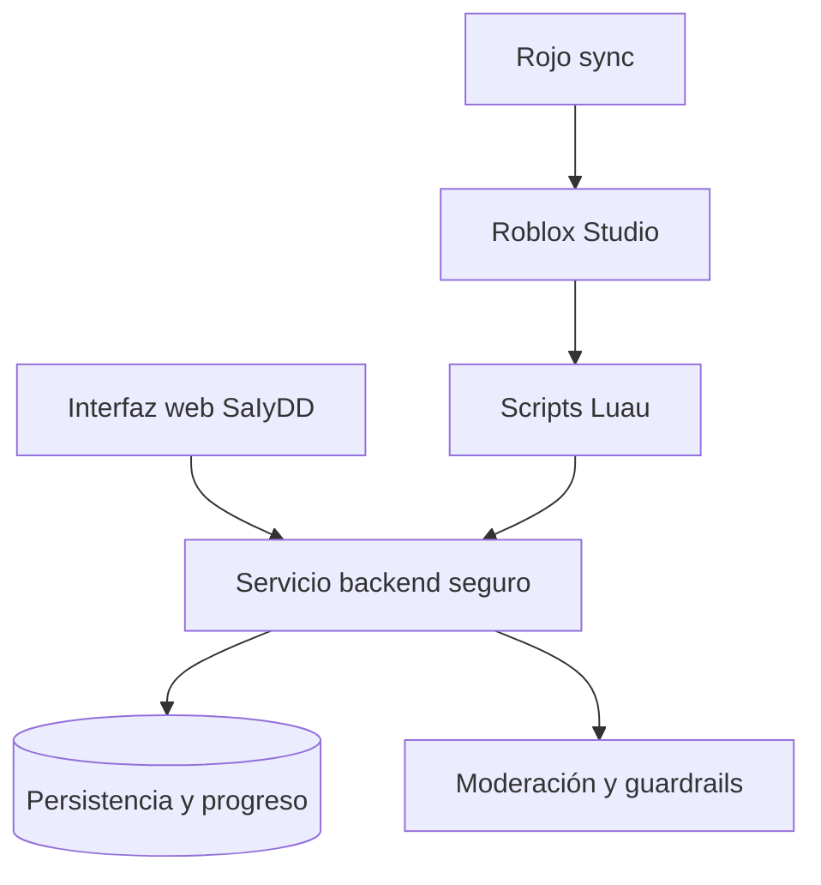

# SaIyDD — Sistema de Aprendizaje Inclusivo

> Prototipo educativo kid-safe para niños de 4 a 8 años, con actividades gamificadas, mascota guía, interacción por voz y panel de progreso para tutores.

Repositorio: [gproatechnology/GProA_SAIyDD](https://github.com/gproatechnology/GProA_SAIyDD.git)

## Estado del proyecto

**Estado actual:** prototipo funcional en fase alfa.

La demo web está implementada en el entorno:

```text
../Pagina_web/proyectos/saiydd/demo/
```

Este repositorio actúa como raíz de documentación y coordinación del producto. La integración con Roblox Studio y Rojo está planificada como siguiente fase.

## Arquitectura



### Flujo principal



## Módulos web

| Módulo | Responsabilidad |
|---|---|
| `app.js` | Router, vistas y coordinación general |
| `bienvenida.js` | Selección de avatar y recuperación del perfil local |
| `menu.js` | Navegación principal |
| `chatbot.js` | Asistente local con respuestas preaprobadas |
| `juego.js` | Actividades, validación y registro de sesiones |
| `mascota.js` | Expresiones y texto a voz |
| `mascota-ui.js` | Componentes visuales de la mascota |
| `voz.js` | Reconocimiento de voz limitado |
| `dashboard.js` | Panel de progreso para tutores |
| `api.js` | Adaptador mock preparado para un backend |
| `blocks-world.js` | Actividad interactiva en canvas |
| `sanitize.js` | Validación y saneamiento de texto |
| `rate-limiter.js` | Límites locales por tipo de acción |

## Estructura prevista del repositorio

```text
SAIyDD/
├── LICENSE
├── README.md
├── SDD_SaIyDD.md
├── demo/
│   ├── index.html
│   ├── package.json
│   ├── package-lock.json
│   ├── vite.config.js
│   └── src/
│       ├── assets/
│       ├── css/
│       └── js/
├── docs/
│   ├── manual-usuario.html
│   ├── manual.css
│   └── data.js
└── rojo/
    └── default.project.json       # Pendiente de crear
```

La estructura anterior describe el objetivo de consolidación. Actualmente la implementación web completa se encuentra en el entorno sibling indicado al inicio.

## Ejecución de la demo

Desde el entorno que contiene la implementación:

```powershell
cd ..\Pagina_web\proyectos\saiydd\demo
npm install
npm run dev
```

La demo se abre en `http://localhost:5174`.

Para generar una build de producción:

```powershell
npm run build
```

## Integración con Roblox



### Preparación actual

| Elemento | Estado |
|---|---|
| Demo web Vite | Funcional |
| Repositorio Git remoto | Conectado y sincronizado |
| Roblox Studio | Instalado localmente |
| Rojo | Pendiente de instalar/configurar |
| Proyecto Roblox | Pendiente de crear o enlazar |
| Backend seguro | Pendiente |
| Pruebas automatizadas | Pendientes |
| Configuración de accesibilidad y seguridad productiva | Pendiente |

El siguiente paso técnico es crear la estructura de sincronización Rojo, definir el lugar del proyecto Roblox y establecer el contrato API entre Luau, el backend y la demo web.

## Seguridad y alcance de la demo

- Los datos de perfil y progreso se guardan en `localStorage` del navegador.
- El chat y las actividades usan respuestas preaprobadas; no hay generación libre.
- La voz depende de APIs nativas del navegador y puede no estar disponible en todos los entornos.
- El PIN mostrado en la demo es únicamente de prueba y no debe utilizarse en producción.
- Antes de una publicación real se deben completar validaciones de seguridad, accesibilidad, moderación, consentimiento y privacidad infantil.

## Roadmap

1. Consolidar en este repositorio la demo, documentación y configuración compartida.
2. Corregir los hallazgos críticos de seguridad, el PIN de prueba y la fuga de animación.
3. Añadir pruebas automatizadas, linting y validación de accesibilidad.
4. Crear la configuración `default.project.json` y la estructura Luau para Rojo.
5. Definir backend, autenticación de tutores y contrato API.
6. Conectar Roblox Studio con el servicio compartido y validar el flujo completo.

## Licencia

Ver [LICENSE](LICENSE).
