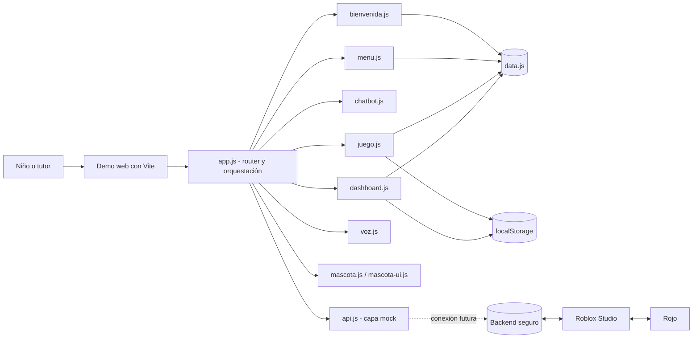
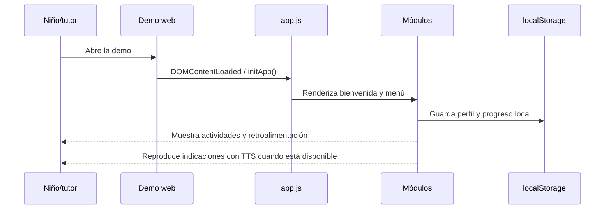
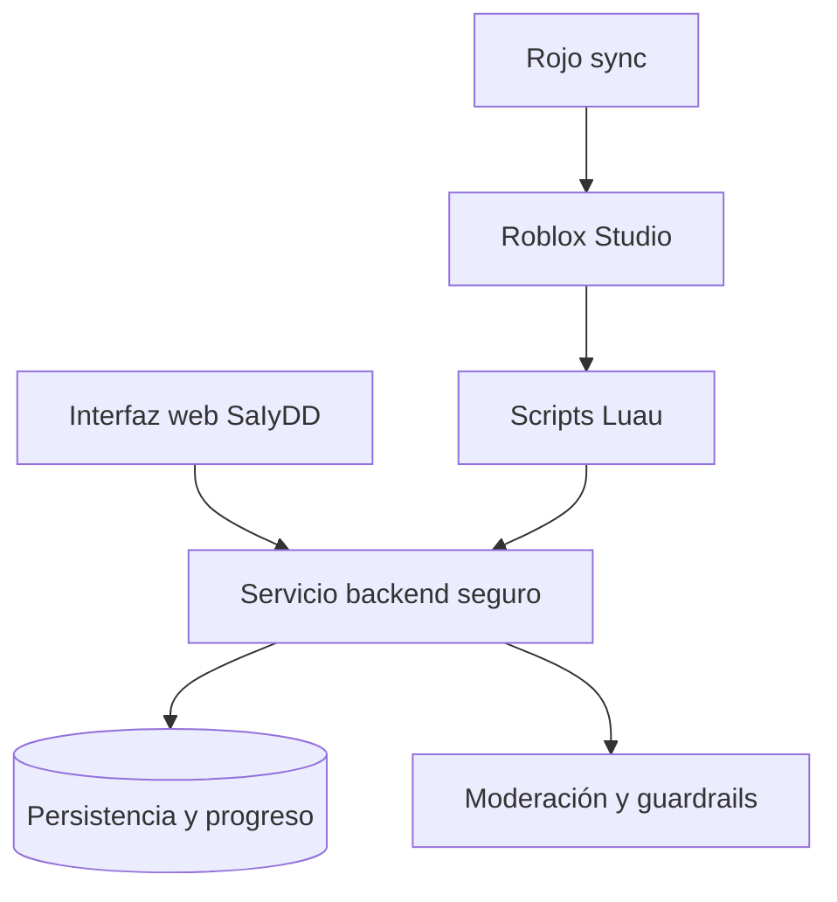

# SaIyDD — Sistema de Aprendizaje Inclusivo

> Prototipo educativo kid-safe para niños de 4 a 8 años, con actividades gamificadas, mascota guía, interacción por voz y panel de progreso para tutores.

Repositorio: [gproatechnology/GProA_SAIyDD](https://github.com/gproatechnology/GProA_SAIyDD.git)

## Estado del proyecto

**Estado actual:** prototipo funcional en fase alfa — **consolidado en este repositorio**.

La demo web y la documentación ya están versionadas aquí:

```text
SAIyDD/
├── demo/           # Demo Vite completa (fuentes, assets, build config)
├── docs/           # Manual de usuario interactivo + datos
└── rojo/           # Preparado para sincronización Rojo (pendiente default.project.json)
```

## Arquitectura



### Flujo principal



## Módulos web

| Módulo | Responsabilidad |
|---|---|
| `app.js` | Router, vistas y coordinación general |
| `bienvenida.js` | Selección de avatar y recuperación del perfil local |
| `menu.js` | Navegación principal |
| `chatbot.js` | Asistente local con respuestas preaprobadas |
| `juego.js` | Actividades, validación y registro de sesiones |
| `mascota.js` | Expresiones y texto a voz |
| `mascota-ui.js` | Componentes visuales de la mascota |
| `voz.js` | Reconocimiento de voz limitado |
| `dashboard.js` | Panel de progreso para tutores |
| `api.js` | Adaptador mock preparado para un backend |
| `blocks-world.js` | Actividad interactiva en canvas |
| `sanitize.js` | Validación y saneamiento de texto |
| `rate-limiter.js` | Límites locales por tipo de acción |

## Estructura del repositorio

```text
SAIyDD/
├── LICENSE
├── README.md
├── SDD_SaIyDD.md          # Documento de Diseño de Software
├── demo/
│   ├── index.html
│   ├── package.json
│   ├── package-lock.json
│   ├── vite.config.js
│   └── src/
│       ├── assets/
│       │   └── images/
│       ├── css/
│       │   ├── variables.css
│       │   ├── styles.css
│       │   └── modules/
│       │       ├── screens.css
│       │       └── blocks-world.css
│       ├── js/
│       │   ├── main.js
│       │   ├── modules/
│       │   │   ├── app.js
│       │   │   ├── bienvenida.js
│       │   │   ├── menu.js
│       │   │   ├── chatbot.js
│       │   │   ├── dashboard.js
│       │   │   ├── juego.js
│       │   │   ├── mascota.js
│       │   │   ├── mascota-ui.js
│       │   │   ├── voz.js
│       │   │   ├── blocks-world.js
│       │   │   └── api.js
│       │   ├── utils/
│       │   │   ├── sanitize.js
│       │   │   └── rate-limiter.js
│       │   └── data/
│       │       └── data.js
├── docs/
│   ├── manual-usuario.html   # Manual interactivo con búsqueda, TOC, tema
│   ├── manual.css
│   └── data.js               # Contenido y renderizado del manual
└── rojo/
    ├── shared/               # ModuleScripts compartidos (pendiente)
    ├── server/               # Scripts ServerScriptService (pendiente)
    ├── client/               # Scripts StarterPlayerScripts (pendiente)
    └── default.project.json  # Pendiente de crear
```

## Ejecución de la demo

Desde la raíz del repo:

```powershell
cd demo
npm install
npm run dev
```

La demo se abre en `http://localhost:5174`.

Para generar una build de producción:

```powershell
npm run build
```

## Manual de usuario

Abrir `docs/manual-usuario.html` en el navegador (o servir con `npx serve docs`). Incluye:

- Tabla de contenidos navegable
- Búsqueda en tiempo real
- Tema claro/oscuro persistente
- Secciones: introducción, acceso, mascota, menú, juego, chatbot, voz, dashboard, seguridad, alcance, FAQ, soporte

## Integración con Roblox



### Preparación actual

| Elemento | Estado |
|---|---|
| Demo web Vite | ✅ Consolidada en `demo/` |
| Documentación | ✅ Consolidada en `docs/` |
| Repositorio Git remoto | ✅ Conectado y sincronizado |
| Roblox Studio | ✅ Instalado localmente |
| Rojo (extensión + CLI) | ⏳ Pendiente de instalar/configurar |
| Proyecto Roblox (`default.project.json`) | ⏳ Pendiente |
| Backend seguro | ⏳ Pendiente |
| Pruebas automatizadas | ⏳ Pendientes |
| Accesibilidad y seguridad productiva | ⏳ Pendiente |

El siguiente paso técnico es instalar la extensión Rojo + CLI, crear `rojo/default.project.json` y la estructura `shared/server/client` para Luau.

## Seguridad y alcance de la demo

- Los datos de perfil y progreso se guardan en `localStorage` del navegador.
- El chat y las actividades usan respuestas preaprobadas; no hay generación libre.
- La voz depende de APIs nativas del navegador y puede no estar disponible en todos los entornos.
- El PIN mostrado en la demo es únicamente de prueba (`1234`) y no debe utilizarse en producción.
- Antes de una publicación real se deben completar validaciones de seguridad, accesibilidad, moderación, consentimiento y privacidad infantil.

## Roadmap

1. ✅ Consolidar en este repositorio la demo, documentación y configuración compartida.
2. Corregir los hallazgos críticos de seguridad, el PIN de prueba y la fuga de animación.
3. Añadir pruebas automatizadas, linting y validación de accesibilidad.
4. Instalar extensión Rojo + CLI y crear `default.project.json` + estructura Luau.
5. Definir backend, autenticación de tutores y contrato API.
6. Conectar Roblox Studio con el servicio compartido y validar el flujo completo.

## Licencia

Ver [LICENSE](LICENSE).