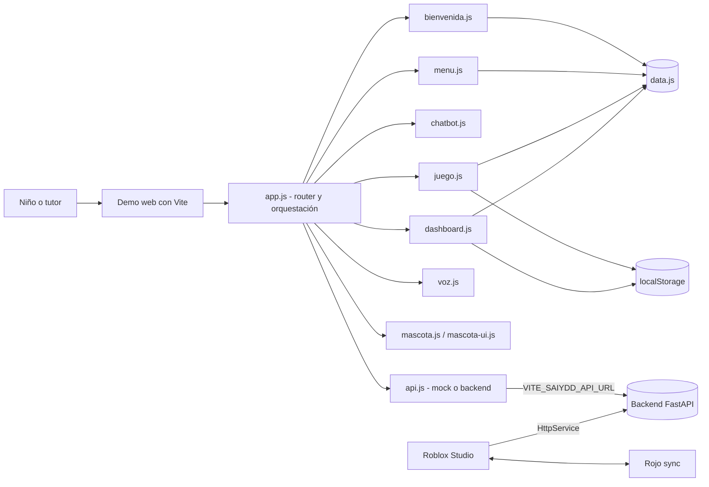
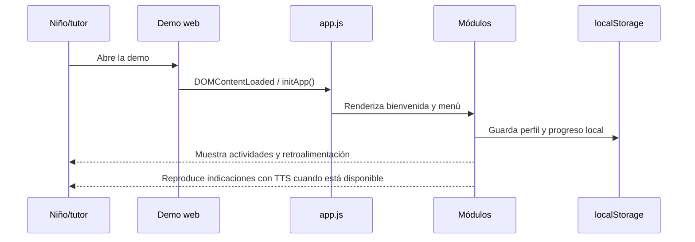
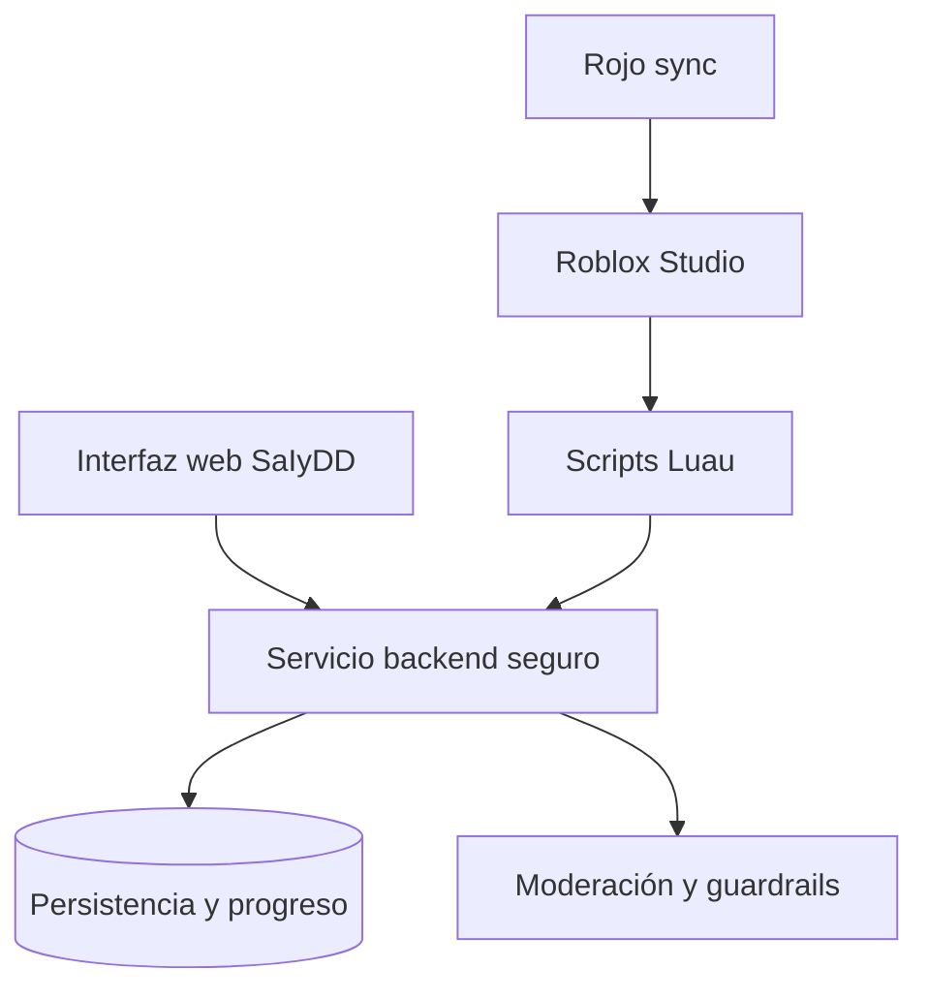
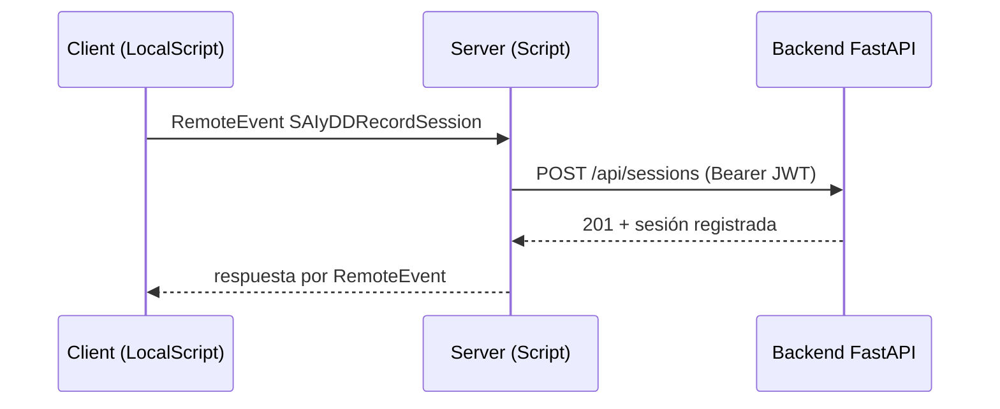

# SaIyDD — Sistema de Aprendizaje Inclusivo

> Prototipo educativo kid-safe para niños de 4 a 8 años, con actividades gamificadas, mascota guía, interacción por voz y panel de progreso para tutores.

Repositorio: [gproatechnology/GProA_SAIyDD](https://github.com/gproatechnology/GProA_SAIyDD.git)

## Estado del proyecto

**Estado actual:** prototipo funcional en fase alfa — **consolidado en este repositorio**.

La demo web y la documentación ya están versionadas aquí:

```text
SAIyDD/
├── demo/           # Demo Vite completa (fuentes, assets, build config)
├── docs/           # Manual de usuario interactivo + datos
└── rojo/           # Sincronización Rojo verificada (shared/server/client)
```

## Arquitectura


```mermaid
flowchart LR
    U[Niño o tutor] --> W[Demo web con Vite]
    W --> A[app.js - router y orquestación]
    A --> B[bienvenida.js]
    A --> M[menu.js]
    A --> C[chatbot.js]
    A --> J[juego.js]
    A --> G[dashboard.js]
    A --> V[voz.js]
    A --> P[mascota.js / mascota-ui.js]
    B --> D[(data.js)]
    M --> D
    J --> D
    G --> D
    J --> L[(localStorage)]
    G --> L
    A --> API[api.js - mock o backend]
    API -- VITE_SAIYDD_API_URL --> BE[(Backend FastAPI)]
    X[Roblox Studio] -- HttpService --> BE
    X <--> ROJO[Rojo sync]
```

### Flujo principal


```mermaid
sequenceDiagram
    participant N as Niño/tutor
    participant W as Demo web
    participant A as app.js
    participant M as Módulos
    participant S as localStorage

    N->>W: Abre la demo
    W->>A: DOMContentLoaded / initApp()
    A->>M: Renderiza bienvenida y menú
    M->>S: Guarda perfil y progreso local
    M-->>N: Muestra actividades y retroalimentación
    M-->>N: Reproduce indicaciones con TTS cuando está disponible
```

## Módulos web

| Módulo | Responsabilidad |
|---|---|
| `app.js` | Router, vistas y coordinación general |
| `bienvenida.js` | Selección de avatar y recuperación del perfil local |
| `menu.js` | Navegación principal |
| `chatbot.js` | Asistente local con respuestas preaprobadas |
| `juego.js` | Actividades, validación y registro de sesiones |
| `mascota.js` | Expresiones y texto a voz |
| `mascota-ui.js` | Componentes visuales de la mascota |
| `voz.js` | Reconocimiento de voz limitado |
| `dashboard.js` | Panel de progreso para tutores |
| `api.js` | Puerta de acceso mock: datos públicos + `submitAnswer()` |
| `blocks-world.js` | Actividad interactiva en canvas |
| `sanitize.js` | Validación y saneamiento de texto |
| `rate-limiter.js` | Límites locales por tipo de acción |

## Estructura del repositorio

```text
SAIyDD/
├── .github/
│   └── workflows/ci.yml   # CI: demo (npm) + backend (pytest + ruff)
├── LICENSE
├── README.md
├── backend/        # API FastAPI (Python) — venv, .env y *.db ignorados
│   ├── requirements.txt
│   ├── requirements-dev.txt
│   ├── .env.example
│   ├── app/        # main, auth, errors, repositories, models, schemas, seed
│   └── tests/      # pytest + httpx (TestClient)
├── demo/
│   ├── index.html
│   ├── package.json
│   ├── package-lock.json
│   ├── vite.config.js
│   └── src/
│       ├── assets/
│       │   └── images/
│       ├── css/
│       │   ├── variables.css
│       │   ├── styles.css
│       │   └── modules/
│       │       ├── screens.css
│       │       └── blocks-world.css
│       ├── js/
│       │   ├── main.js
│       │   ├── modules/
│       │   │   ├── app.js
│       │   │   ├── bienvenida.js
│       │   │   ├── menu.js
│       │   │   ├── chatbot.js
│       │   │   ├── dashboard.js
│       │   │   ├── juego.js
│       │   │   ├── mascota.js
│       │   │   ├── mascota-ui.js
│       │   │   ├── voz.js
│       │   │   ├── blocks-world.js
│       │   │   └── api.js
│       │   ├── utils/
│       │   │   ├── sanitize.js
│       │   │   └── rate-limiter.js
│       │   └── data/
│       │       └── data.js
├── docs/
│   ├── manual-usuario.html   # Manual interactivo con búsqueda, TOC, tema
│   ├── manual.css
│   └── data.js               # Contenido y renderizado del manual
├── rojo-manager.ps1        # Gestor interactivo: Rojo + backend + flujo completo
└── rojo/
    ├── shared/               # init.lua: contrato compartido (sin secretos)
    ├── server/               # main.lua (HttpService + JWT) + secrets.lua (ignorado)
    ├── client/               # main.lua: bridge cliente (RemoteEvents)
    ├── default.project.json  # Árbol sincronizado con Studio (incluye Events)
    └── secrets.example.lua   # Plantilla de credenciales del servicio
```

## Ejecución de la demo

Desde la raíz del repo:

```powershell
cd demo
npm install
npm run dev
```

La demo se abre en `http://localhost:5174`.

Para generar una build de producción:

```powershell
npm run build
```

Calidad de código:

```powershell
npm run lint          # ESLint
npm run format        # Prettier (escribe)
npm run format:check  # Prettier (verifica)
npm test              # Vitest (26 pruebas)
```

## Backend (API)

```powershell
cd backend
.venv\Scripts\python.exe -m pip install -r requirements.txt
.venv\Scripts\python.exe -m uvicorn app.main:app --host 127.0.0.1 --port 8000
```

- Auth de tutores: `POST /api/auth/register` y `POST /api/auth/login` (bcrypt + JWT HS256, token Bearer con `role`).
- Rutas de dominio protegidas con la dependencia `require_tutor` (401 sin/Con token inválido, 403 con rol insuficiente); `/api/health` y `/api/activities` son públicas.
- Rate limiting con slowapi (login 10/min, registro 5/hora) y errores con formato `{"error": {"code", "message"}}`.
- Configuración vía variables de entorno (ver `backend/.env.example`), incluye `JWT_SECRET`.
- La demo se conecta al backend real configurando `VITE_SAIYDD_API_URL` y `VITE_SAIYDD_API_TOKEN` (ver `demo/.env.example`); sin esas variables usa su mock local. `submitAnswer` sigue siendo local: las respuestas son preaprobadas y no existe endpoint de validación.
- Pruebas del backend: `pytest` (14 pruebas con `httpx`/TestClient en `backend/tests/`); lint con `ruff`. Ambos corren en CI (job `backend`).
- La cuenta de servicio de Roblox se registra con `POST /api/auth/register` (o con la opción 8 de `rojo-manager.ps1`); sus credenciales viven en `rojo/server/secrets.lua` (ignorado por git).

## Manual de usuario

Abrir `docs/manual-usuario.html` en el navegador (o servir con `npx serve docs`). Incluye:

- Tabla de contenidos navegable
- Búsqueda en tiempo real
- Tema claro/oscuro persistente
- Secciones: introducción, acceso, mascota, menú, juego, chatbot, voz, dashboard, seguridad, alcance, FAQ, soporte

## Integración con Roblox


```mermaid
flowchart TB
    WEB[Interfaz web SaIyDD] --> API[Servicio backend seguro]
    STUDIO[Roblox Studio] --> LU[Scripts Luau]
    LU --> API
    API --> DB[(Persistencia y progreso)]
    API --> MOD[Moderación y guardrails]
    ROJO[Rojo sync] --> STUDIO
```

### Flujo Studio ↔ backend


```mermaid
sequenceDiagram
    participant C as Client (LocalScript)
    participant S as Server (Script)
    participant B as Backend FastAPI
    C->>S: RemoteEvent SAIyDDRecordSession
    S->>B: POST /api/sessions (Bearer JWT)
    B-->>S: 201 + sesión registrada
    S-->>C: respuesta por RemoteEvent
```

- `rojo/shared/init.lua`: contrato compartido (endpoints, payloads, RemoteEvents) — sin secretos.
- `rojo/server/main.lua`: cliente HTTP (`HttpService:RequestAsync`), login de cuenta de servicio con cache de JWT y relogin ante 401, handlers de los RemoteEvents.
- `rojo/client/main.lua`: bridge cliente (`Client.recordSession` / `Client.healthCheck`, corrutinas con timeout).
- `rojo/server/secrets.lua`: credenciales del servicio (ignorado por git; plantilla en `rojo/secrets.example.lua`).

### Uso con `rojo-manager.ps1`

```powershell
.\rojo-manager.ps1
# [7] Iniciar/detener backend (uvicorn :8000)
# [8] Flujo completo: cuenta de servicio + niño de prueba + sesión + progreso
# [9] Estado integral (puertos, Rojo, backend, árbol sincronizado)
```

La opción 8 guarda `{apiUrl, token, childId}` en `%TEMP%\saiydd-state.json` para la prueba manual en Studio.

### Prueba en vivo en Studio (manual)

1. Studio → **Game Settings → Security → Allow HTTP Requests = ON**.
2. `rojo serve rojo\default.project.json --port 34872` (o opción 1 del gestor) → Studio: **Plugins → Rojo → Connect to Rojo**.
3. **Play (F5)**: en Output aparecen los mensajes `[SaIyDD]` de handlers y servicio.
4. Durante el Play, un LocalScript temporal en StarterPlayerScripts:

   ```lua
   local Client = require(script.Parent:WaitForChild("Client"))
   task.spawn(function()
       local reply = Client.recordSession("child_ID_AQUI", "act_001", 100, 90)
       print("[TEST] recordSession ->", reply.ok)
   end)
   ```

5. Verificar la persistencia compartida:

   ```powershell
   curl.exe -H "Authorization: Bearer $token" http://127.0.0.1:8000/api/children/$childId/progress
   ```

### Preparación actual

| Elemento | Estado |
|---|---|
| Demo web Vite | ✅ Consolidada en `demo/` |
| Documentación | ✅ Consolidada en `docs/` |
| Repositorio Git remoto | ✅ Conectado y sincronizado |
| Roblox Studio | ✅ Instalado localmente |
| Rojo (extensión + CLI) | ✅ Instalado y configurado |
| Proyecto Roblox (`default.project.json`) | ✅ Completado |
| Servicio Roblox (Luau + RemoteEvents) | ✅ Contrato, cliente HTTP y bridge |
| Backend + auth de tutores | ✅ SQLModel, bcrypt + JWT, tests y CI |
| Pruebas, linting y accesibilidad | ✅ Completados |
| Accesibilidad y seguridad productiva | ⏳ Pendiente |

La sincronización Rojo, el backend y la integración Studio ↔ backend están verificados (`rojo build`, `rojo serve`, flujo API de extremo a extremo). Pendiente: la prueba de Play en Studio (ver "Prueba en vivo en Studio").

## Seguridad y alcance de la demo

- Los datos de perfil y progreso se guardan en `localStorage` del navegador.
- El chat y las actividades usan respuestas preaprobadas; no hay generación libre.
- La voz depende de APIs nativas del navegador y puede no estar disponible en todos los entornos.
- El PIN del panel de padres se configura con la variable de entorno `VITE_SAIYDD_PIN` (ver `demo/.env.example`); el valor por defecto es solo para demo y no debe usarse en producción.
- La demo ya no expone datos en globales (`window.dataMock` eliminado); las respuestas del juego se validan vía `api.submitAnswer()` y el cliente solo recibe el subconjunto público de cada actividad.
- La API del backend protege las rutas de tutor con JWT (registro/login con bcrypt, rate limiting con slowapi, errores estandarizados); el secreto se configura con `JWT_SECRET` (ver `backend/.env.example`).
- La integración Roblox usa una cuenta de servicio de tutor: las credenciales viven en `rojo/server/secrets.lua` (ignorado por git) y el JWT solo existe en ServerScriptService, nunca en el cliente.
- Antes de una publicación real se deben completar validaciones de seguridad, accesibilidad, moderación, consentimiento y privacidad infantil.

## Roadmap

1. ✅ Consolidar en este repositorio la demo, documentación y configuración compartida.
2. ✅ Corregir los hallazgos críticos de seguridad (PIN externalizado + fuga de datos cerrada).
3. ✅ Añadir pruebas automatizadas (Vitest), linting (ESLint + Prettier), accesibilidad y CI (GitHub Actions).
4. ✅ Instalar extensión Rojo + CLI y crear `default.project.json` + estructura Luau.
5. ✅ Sincronizar Roblox Studio con Rojo (live sync verificado + `rojo build` funcional).
6. ✅ Backend: persistencia SQLModel, auth de tutores (bcrypt + JWT), integración demo↔backend, tests y CI.
7. ⏳ En progreso: Roblox Studio ↔ backend vía Rojo (contrato, cliente HTTP con JWT, RemoteEvents, `rojo-manager.ps1` extendido). Pendiente: prueba de Play en Studio (ver "Integración con Roblox").

## Licencia

Ver [LICENSE](LICENSE).